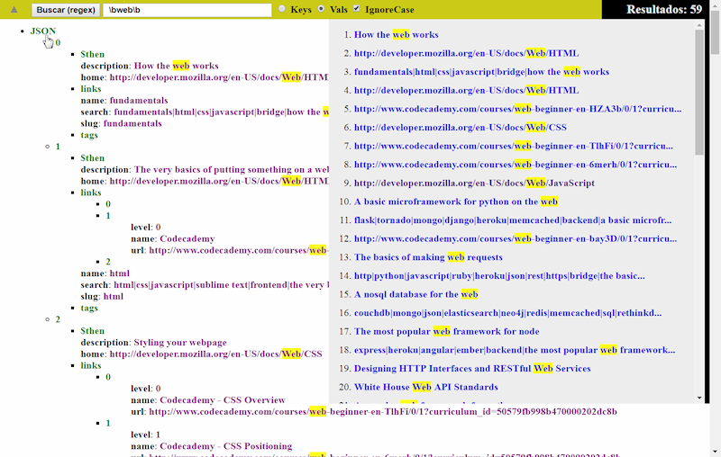

# HTML+JS JSON Viewer

- Open/View any type of JSON as tree
- Search regular expressions on keys & values
- Open, list & highlight results
- Left click to open one level
- Right click to full open the branch
- Open/View any JSON locally with provided JSON to JS converter (Python 2.7+ & 3.4+)

[Insane security restrictions](http://kb.mozillazine.org/Security.fileuri.strict_origin_policy) won't allow you to open a JSON file in your browser using javascript. You can do it in a web server, but not in your home computer. That's crazy right? The big brother is protecting us from ourselves. I love that.

Well you can workaround this by creating a .JS file with a variable that is the JSON string. Parse that string and then you can do all the things you want with it.

I provide a simple python script that does just that for you:

    python json2jsondata.py -f input.json

This creates a [jsondata.js](jsondata.js) file that holds your JSON "securely" for you to [view](view.html) it.

To view the json file simply dobleclick on **view.html**.

**License:** GNU3

**Author:** @sanxofon
